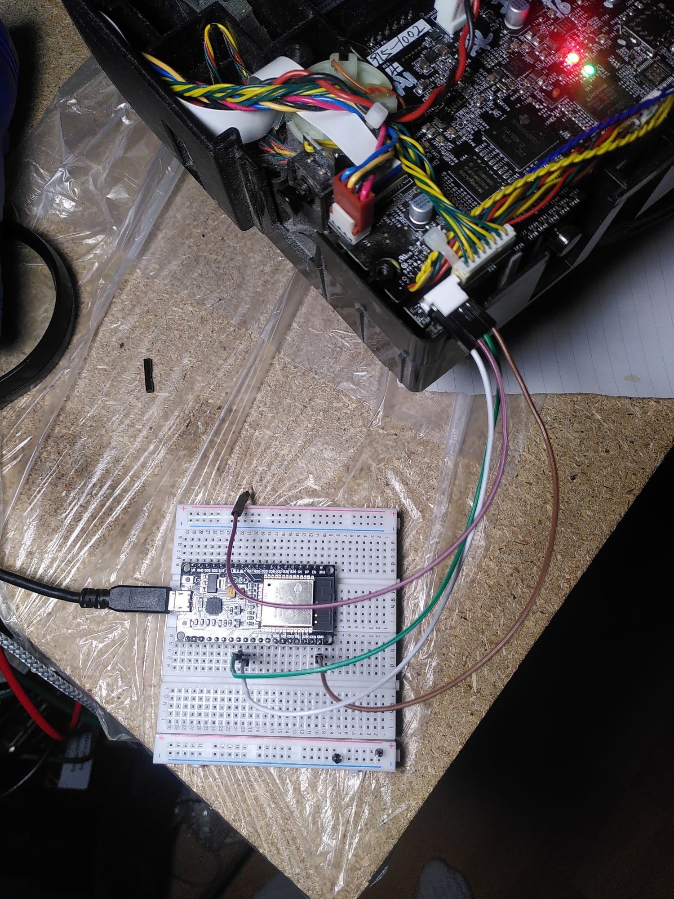

# Esp32 micropython code
## Hardware: ESP32-DevKitC V2
 * Chip is ESP32-D0WDQ6 (revision v1.0)
 * Features: WiFi, BT, Dual Core, 240MHz, VRef calibration in efuse, Coding Scheme None
 * [ESP32-DevKitC V2 guide](https://documentation.espressif.com/projects/esp-dev-kits/en/latest/esp32/esp32-devkitc/user_guide.html?title=ESP32-DevKitC%20V2%20Getting%20Started%20Guide)

## Starting with micropython
  [Install guide](https://micropython.org/download/ESP32_GENERIC/)

## Install the code
 * ``sudo mpremote connect /dev/cuaU0 cp *.py :``
 * ``sudo mpremote connect /dev/cuaU0 reset repl``

## Boot sequence
 * Startup
    * If wifi not configured 
        * display [configuation setup page](https://github.com/tayfunulu/WiFiManager/)
    * Else
        * open UART  play sound 1 (Start cleaning session)
        * Start webserver to display GetVersion output

## Cabling

# neatoVacumRessources

This page is a collection of ressources about Neato Vacuum devices and how to revive them after cloud server shudown

## Links
 * [Philip2809/neato-connected](https://github.com/Philip2809/neato-connected) github repo : Howto connect your Neato Vacuum to a Home Assistant as an "ESP device"
 * [jeroenterheerdt/neato-serial](https://github.com/jeroenterheerdt/neato-serial) github repo : Howto use the serial interface to communicate to your Neato robot vacuum cleaners, demo video, serial command manual
 * [RobertSundling/neato-botvac](https://github.com/RobertSundling/neato-botvac) github repo : Neato firmware ressources (latest available firmware, how to flash your Neato vacuum)
 * [Neato Serial Programmer’s Manual 3.1](https://help.neatorobotics.com/wp-content/uploads/2020/07/XV-ProgrammersManual-3_1.pdf)
 * [How to Control a Neato Robot From a Raspberry Pi](https://www.instructables.com/How-to-Control-a-Neato-Robot-From-a-Raspberry-Pi/)
 * [Neato D-Series Lidar and Raspberry Pi 3A+ with ROS](https://hackaday.io/project/171893-neato-d-series-lidar-and-raspberry-pi-3a-with-ros)
 * [neato-connected-D8](https://github.com/algaen/neato-connected-D8) more details about the D8, and picture of D3 to D8 boards descriptions
 * [LoyVanBeek/neato_ros2](https://github.com/LoyVanBeek/neato_ros2)
 * [Neato ROS drivers, catkinized, and ready for ROS Groovy and newer](https://github.com/mikeferguson/neato_robot)
 * [ROS 2 Documentation](https://wiki.ros.org/2dnav_neato)
 * [ROS2 Using Neato BotVac D5 Connected Robot & 8GB Raspberry Pi4](https://www.technologyx2.com/blog_hightech/2021/6/6/project-ros2-using-neato-botvac-d5-connected-robot-amp-raspberry-pi4-8bg)
 * [Neato + ROS = Robot Navigation](https://www.servomagazine.com/magazine/article/neato-ros-robot-navigation)
 * [Neato Scheduler](https://github.com/HawtDogFlvrWtr/botvac-wifi)
 * 
   
## Few notes about the Neato Bovac D6 (for now)
 - To dissasemble it you need a TORX T10H screw driver
